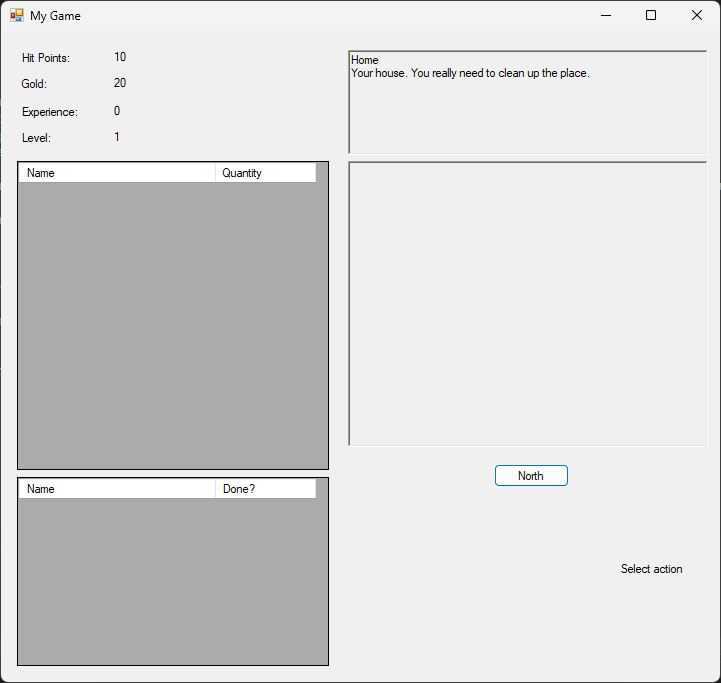
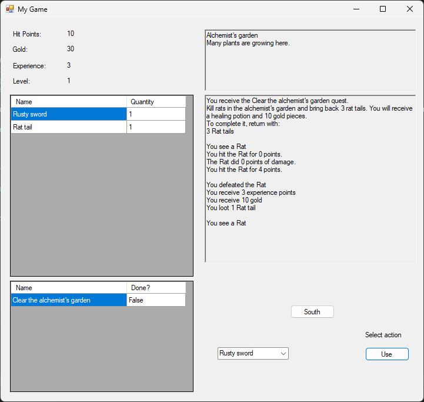

# SuperAdventure

🎮 RPG Game in C#

## 📖 Overview

**SuperAdventure** is a simple console-based role-playing game (RPG) built with C#. Developed by following the tutorial series by [Scott Lilly](https://scottlilly.com/learn-c-by-building-a-simple-rpg-index/), the project is designed to teach fundamental concepts in object-oriented programming and game logic.

In this game, players take on the role of an adventurer who travels through different locations, fights monsters, completes quests, and gains experience to level up. It's a great hands-on way to reinforce C# programming skills while creating a fun and interactive application.

---

## 🛠️ Features

- 🗡️ **Turn-based Combat** – Fight monsters using weapons and potions in turn-based battles.
- 🧭 **Exploration System** – Travel between locations in the world such as your home, town square, and forests.
- 🎯 **Quests** – Accept quests from NPCs to earn rewards.
- 📦 **Inventory Management** – Equip weapons, use potions, and manage your loot.
- ⚔️ **Character Progression** – Earn experience points and level up your character.
- 🧱 **Modular OOP Design** – Built with a clear object-oriented structure (Player, Monster, Weapon, Quest, Location, etc.).

---

## 🚀 Installation & Setup

1. Clone the repository:

   ```bash
   git clone https://github.com/hnguyen169/SuperAdventure

2. Open the solution file (.sln) in Visual Studio.

3. Build the solution.

4. Run the game.

---

## 🎮 How to Play

1. Launch the application through Visual Studio or by running the compiled executable.
2. Use the directional buttons (North, South, East, West) to move between locations.
3. Talk to NPCs (Non-Playable Characters) to receive quests and game instructions.
4. When encountering a monster:
   - Click the weapon button to attack.
   - Use a potion to heal during battle.
5. Monitor your health, experience points (XP), and gold in the status area.
6. Completing quests and defeating enemies will reward you with XP and gold. Level up and explore the world!

Gameplay is navigated through a Windows Forms interface using mouse clicks.

---

## 📷 Screenshots

### 🏠 Home Screen  


### 📜 Quest Received and ⚔️ Combat  


---

## 🙌 Acknowledgments

This project is based on the excellent tutorial series by:

**Scott Lilly**  
[Learn C# by Building a Simple RPG](https://scottlilly.com/learn-c-by-building-a-simple-rpg-index/)
